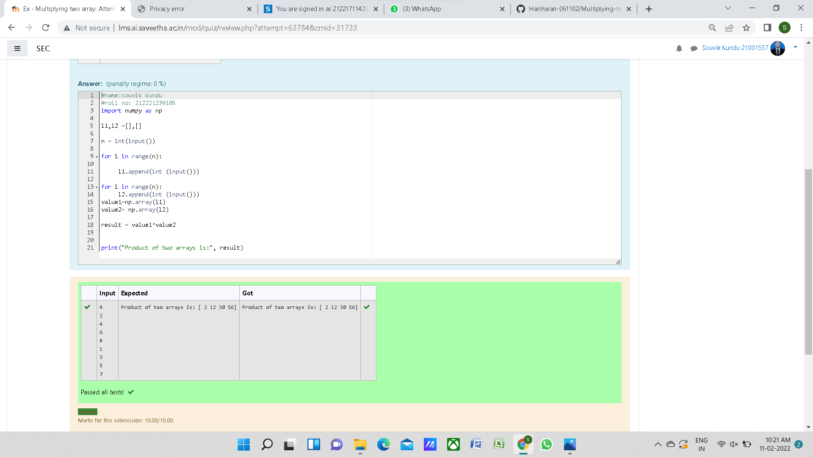

# Multiplying-two-matrix

## AIM:

## ALGORITHM:

### Step 1:

import numpy as np

### Step 2:

find range of the given input

### Step 3:

append the input into the file

### Step 4:

get the result as value * value 2

### Step 5:

print the program

## PROGRAM: 
```
#name:souvik kundu
#roll no: 212221230105
import numpy as np

l1,l2 =[],[]

n = int(input())

for i in range(n):

     l1.append(int (input()))

for i in range(n):
    l2.append(int (input()))

value1=np.array(l1)
value2= np.array(l2)

result = value1*value2


print("Product of two arrays is:", result)

print("Product of two arrays is:", result)

```
## OUTPUT:


## RESULT:
Thus the multiplying two matrix is sucessfully solved using python program
